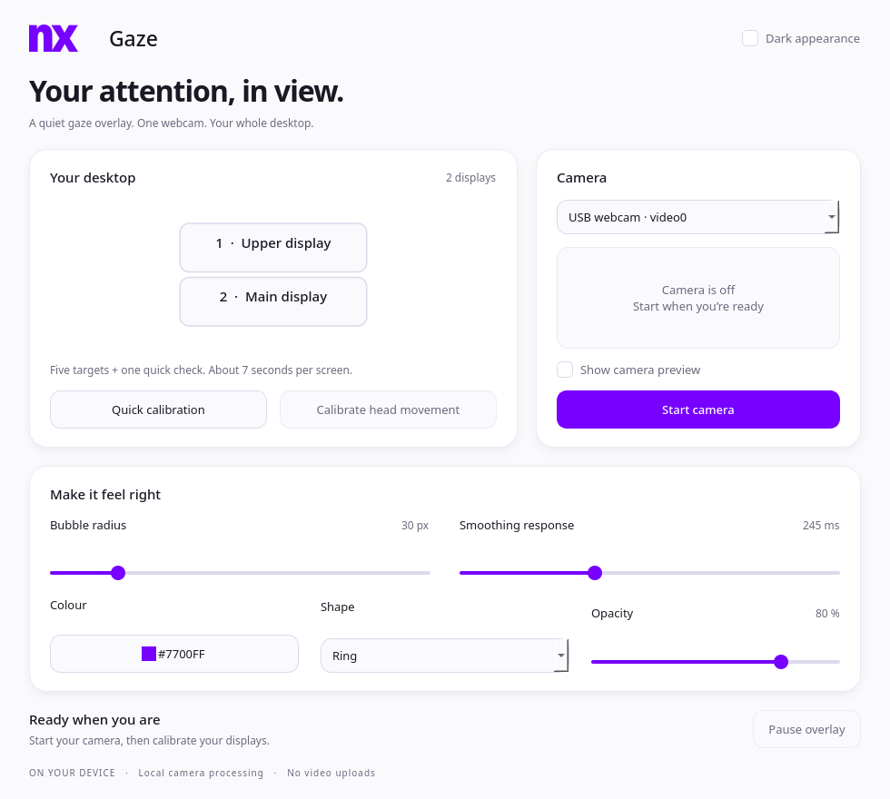

<div align="center">


# NX Gaze

**See where your attention lands.**

A local webcam gaze overlay for your Linux desktop — across your screens.

`Linux` · `Multi-display` · `Local processing` · `GPL-3.0-or-later`

<picture>
  <source media="(prefers-color-scheme: dark)" srcset="docs/control-panel-dark.png">
  
</picture>

*NX Clear interface shown with an example two-display layout; camera off.*

</div>

## A little dot, a bigger desktop

NX Gaze estimates where you are looking and draws a smooth, click-through marker over your desktop. Its control panel follows the [NX Clear design system](https://github.com/nerdrx/nx-hub/blob/main/docs/DESIGN.md), with light and dark surfaces and the official NX wordmark.

- **Calibrate across displays.** Follow five targets and one brief check per screen—about 7 seconds per screen when tracking is stable. Blinks or missed frames may extend this.
- **Keep using your mouse.** The overlay passes clicks through to the application underneath.
- **Conservative head handling.** Track camera-relative position, scale, and continuous orientation in one inference pass. Only enable head adjustments supported by movement while fixating the same target; hide estimates outside the calibrated pose range.
- **Filter blinks.** Hold the last position for up to 400 ms and skip blink/reopening samples. Lost face tracking hides the marker immediately.
- **Tune the feel.** Choose colour, ring/dot/crosshair/diamond shape, 4–160 px radius, 10–100% opacity, and 0–2000 ms smoothing response. Appearance settings persist. Higher smoothing adds visible lag.
- **Keep frames local.** Camera frames are processed on your machine, without recording or uploading them.

This is an experimental gaze visualizer. You must calibrate it for your own camera, posture, and screen arrangement. Live accuracy has not been established; the marker is an estimate, not a precise pointing device.

## Get started

Requirements: Linux, a webcam, Python **3.11 or 3.12**, and an X11 session or KDE Wayland with XWayland available.

On Debian/Ubuntu, Qt may also need system libraries: `sudo apt install libegl1 libopengl0 libxcb-cursor0 libxkbcommon-x11-0`.

Clone the repository, then set up the app:

```bash
git clone https://github.com/nerdrx/nx-gaze.git
cd nx-gaze
./setup.sh
./run.sh
```

Setup creates a project-local virtual environment and installs dependencies. To select a supported Python explicitly:

```bash
NX_GAZE_PYTHON=python3.12 ./setup.sh
```

The first camera start downloads the MediaPipe face model if it is not already cached. Installation and that initial model download require internet access; frame processing runs locally.

1. Select your camera and start it.
2. Start calibration, then look at each target as prompted on every screen.
3. Follow the additional check targets. The overlay starts automatically; adjust its appearance and smoothing.
4. Recalibrate after moving the camera or changing your usual seating position.

Existing v0.1 calibration profiles need a fresh quick calibration for the updated head features. Quick calibration remains available. For head-motion correction, use the optional Calibrate head movement step after gaze calibration.

## Calibrate head movement

After loading or completing gaze calibration, click **Calibrate head movement**. The dot appears on the display containing the control panel.

1. Keep your **eyes on the fixed dot** while gently turning your head left, right, up, and down as prompted; return toward your usual posture after each turn.
2. A second dot checks the candidate correction using separate movements. The app compares the old and new models on the same frames, before smoothing.
3. The app applies and saves the candidate only if this local motion check improves by at least 10% and 3 logical pixels, without material axis regression, with enough motion/range coverage, and without materially worsening existing calibration targets. Otherwise it restores the previous model.

Nominal duration: about **15 seconds**, plus training and extensions for blinks or missing frames. Escape cancels before the final commit. You can reuse your current v0.2 gaze calibration; the extra step is not required on every launch. Accepted samples stay local alongside the existing calibration.

This checks one additional location on the selected display, not every screen position or arbitrary head movement. Repeating the step on another display may help cover a different viewing posture, but improvement is not guaranteed.

## Multiple screens

Screen positions use Qt's global logical desktop coordinates, including displays to the left or above the primary screen. Calibration covers every connected display and trains a single model across them.

The marker hides when a prediction falls in a gap between screens or outside the desktop, after prolonged detected blinks, and when face tracking is lost. Brief detected blinks hold the last position rather than moving the marker. A changed display layout or camera selection invalidates calibration so an old mapping is not silently reused.

Head adjustment is disabled when a calibration lacks enough within-target motion to determine it. This prevents target-correlated head positions from introducing unsupported correction directions; it does not solve unrestricted head-motion tracking. A stationary calibration cannot fully learn large head translations or distance changes; webcam face scale is a relative cue, not metric depth.

Wide monitor arrangements remain a physical challenge: turning toward a side screen can move your eyes out of the camera's useful view. Multi-display coordinate support does not guarantee accurate tracking across every camera angle, scaling configuration, or seating position.

## Privacy and compatibility

- NX Gaze does not record or upload camera frames, and does not require an account or paid API.
- Calibration features and targets are saved locally under `$XDG_STATE_HOME/nx-gaze/calibration.npz` (normally `~/.local/state/nx-gaze/`). No images are saved. Delete that file to forget calibration.
- Stop the camera when you are finished. The gaze marker is visualization only; it does not click, type, or trigger actions.
- The launcher targets X11 and KDE Wayland through Qt's `xcb` backend and XWayland. Overlay placement on other Wayland compositors is not guaranteed.
- Fullscreen games, screen capture, and compositor stacking rules may affect whether the marker is visible or captured.
- Lighting, glasses, occlusion, head movement, and camera placement can affect tracking. The brief post-calibration check reports median error at one held-out position per screen in logical pixels. It cannot establish full-screen or moving-head accuracy.

See [validation notes](docs/VALIDATION.md) for what was tested and what still needs hands-on checks.

## Next, with evidence

- Measure gaze error and tracking loss across real multi-monitor setups.
- Improve calibration feedback and recovery when posture changes.
- Explore **optional gaze-based actions** after tracking is validated: deliberate activation, clear feedback, and an easy off switch.

Gaze-based actions are a future idea, not a feature of this version.

## Built on good work

Gaze estimation is powered by **[EyeTrax](https://github.com/ck-zhang/EyeTrax)** by Chenkai Zhang, using MediaPipe facial features and calibration-based prediction. NX Gaze adds the desktop UI, multi-screen calibration flow, and overlay integration; it does not claim authorship of the underlying tracking technology.

Thanks also to MediaPipe, PyQt6/Qt, OpenCV, NumPy, and scikit-learn. See [third-party credits and license references](THIRD_PARTY.md).

NX Gaze is licensed under **[GPL-3.0-or-later](LICENSE)**. Third-party software and model assets retain their own terms.
